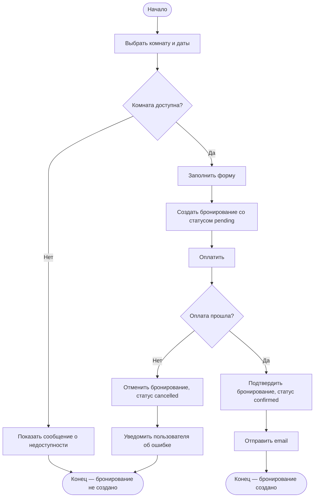
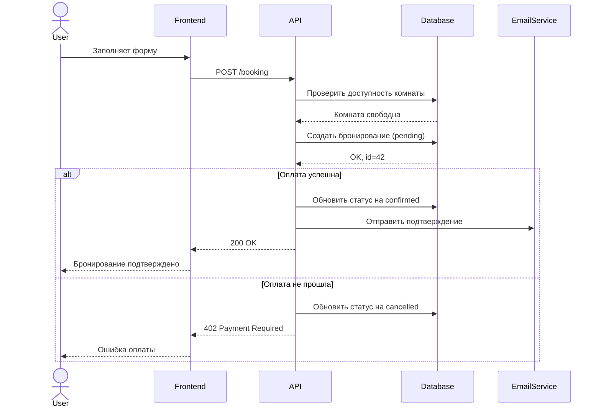
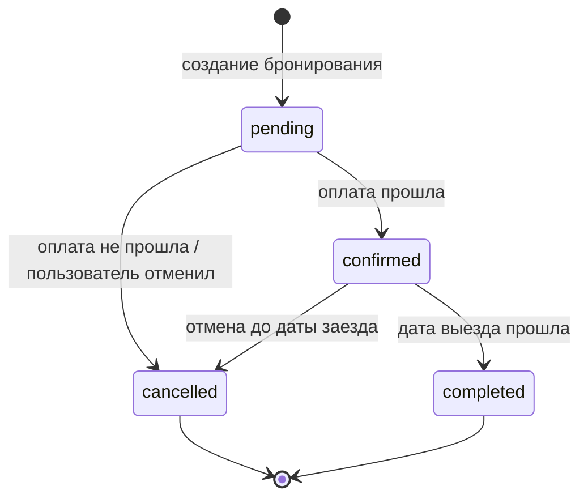

# Задание 5 — Диаграммы

## 1. BPMN — Создание бронирования

Happy path + 2 исключения: комната недоступна, оплата не прошла.

---

## 2. Sequence Diagram — Создание бронирования

---

## 3. State Transition — Статусы бронирования

### Какие переходы важно покрыть тестами

| Переход | Почему |
|---|---|
| pending → confirmed | основной позитивный сценарий |
| pending → cancelled | оплата не прошла — деньги не должны списаться |
| confirmed → cancelled | отмена после оплаты — нужна проверка возврата |
| confirmed → completed | автоматический переход — легко сломать |
| cancelled → pending | недопустимый переход — система не должна это разрешать |
| completed → любой | недопустимый переход — завершённую бронь нельзя изменить |
